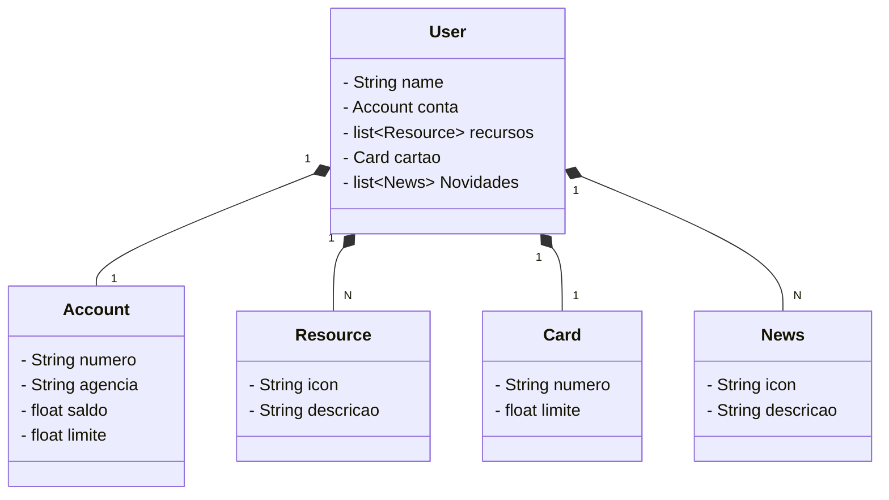

# Santander Dev Week 2024 (adaptado)
Java RESTful API criada para Santander Dev Week.
## Visão Geral
Este projeto é um exemplo de aplicação Spring Boot configurada para usar o banco de dados em memória H2. Ele inclui configuração de JPA, um console H2 acessível via navegador e algumas entidades de exemplo.

## Pré-requisitos
JDK 17 ou superior
Gradle 7.6.1 ou superior
## Configuração do Projeto
### build.gradle
O arquivo build.gradle está configurado com as dependências necessárias para o Spring Boot, JPA, H2 e OpenAPI (Swagger).

## Diagrama de Classe

## Documentação da API
A documentação da API pode ser acessada via Swagger na URL: http://localhost:8080/swagger-ui.html

