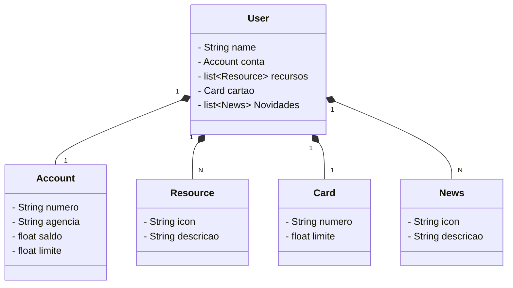

# Santander Dev Week 2024 (adaptado)
Java RESTful API criada para Santander Dev Week.
## Diagrama de Classe

```mermaid
classDiagram
    class User {
        - String name
        - Account conta
        - list~Resource~ recursos
        - Card cartao
        - list~News~ Novidades
    }

    class Account {
        - String numero
        - String agencia
        - float saldo
        - float limite
    }

    class Resource {
        - String icon
        - String descricao
    }

    class Card {
        - String numero
        - float limite
    }

    class News {
        - String icon
        - String descricao
    }

    User "1"*-- "1"Account
    User "1"*-- "N"Resource
    User "1"*-- "1"Card
    User "1"*-- "N"News
```

